# GitOps Delivery Comparison: sfdx-hardis vs Gearset (GitHub Focus)

## Executive Summary

This document compares two Salesforce DevOps approaches for managing deliveries with long-lived branches and permanent orgs (INT, UAT, PROD) using **GitHub** as the version control platform. Both tools support GitHub Actions and Pull Requests (PRs) but differ significantly in implementation, philosophy, and feature sets.

---

## 1. Branch Strategy Overview

### 1.1 sfdx-hardis: Long Branches with Permanent Orgs

sfdx-hardis uses a **BUILD/RUN** separation model with long-lived branches mapped to permanent Salesforce orgs. GitHub Actions workflows are auto-generated during setup.

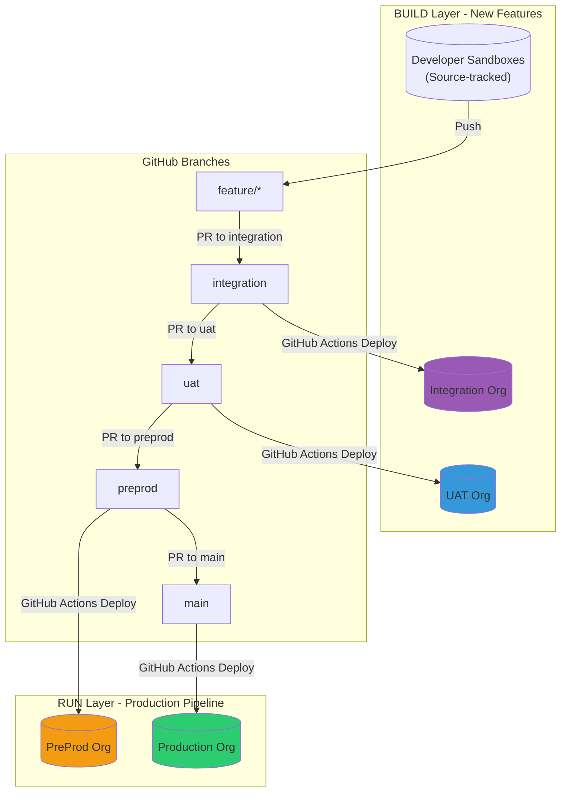

### 1.2 Gearset: Expanded Branching Model

Gearset uses an **expanded branching model** with promotion branches and automatic back-propagation. Integrates natively with GitHub for PR management.

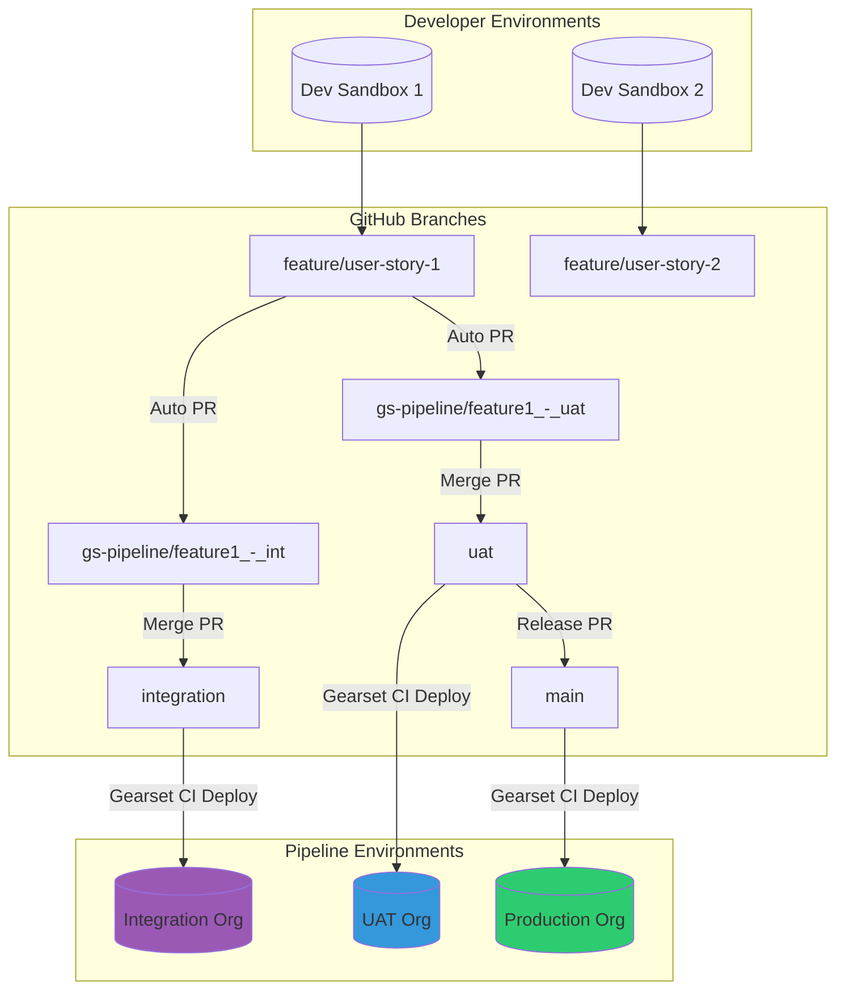

---

## 2. Retrofit vs Back-Propagation

### 2.1 sfdx-hardis Retrofit Process

The retrofit mechanism in sfdx-hardis retrieves production changes and propagates them back to lower environments (typically preprod/uat) via automated GitHub PRs.

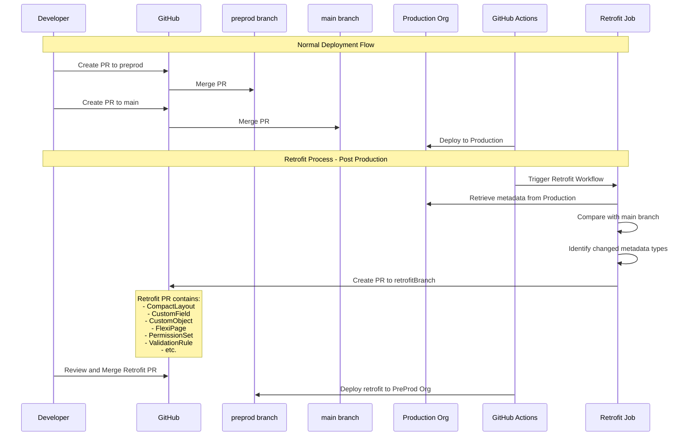

**sfdx-hardis Retrofit Configuration (.sfdx-hardis.yml):**
```yaml
productionBranch: main
retrofitBranch: preprod
sourcesToRetrofit:
  - CompactLayout
  - CustomApplication
  - CustomField
  - CustomLabel
  - CustomMetadata
  - CustomObject
  - FlexiPage
  - Layout
  - PermissionSet
  - ValidationRule
retrofitIgnoredFiles:
  - force-app/main/default/flexipages/Dashboard.flexipage-meta.xml
```

**GitHub Actions Workflow (auto-generated):**
```yaml
name: Retrofit from Production
on:
  workflow_dispatch:
  schedule:
    - cron: '0 6 * * *'  # Daily at 6 AM
jobs:
  retrofit:
    runs-on: ubuntu-latest
    steps:
      - uses: actions/checkout@v4
      - name: Run Retrofit
        run: sf hardis:org:retrieve:sources:retrofit
```

### 2.2 Gearset Back-Propagation Process

Gearset automatically creates back-propagation PRs in GitHub after changes are merged to main, keeping all upstream environments synchronized.

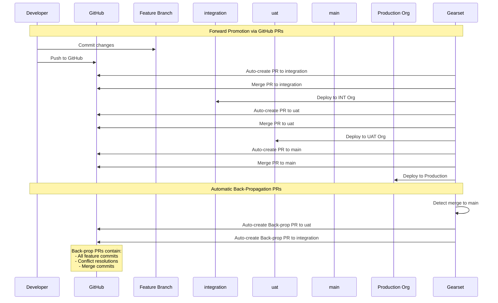

---

## 3. Release Branch Model Comparison

### 3.1 sfdx-hardis: UAT-based Release with GitHub PRs

In sfdx-hardis, the release is essentially the state of the UAT branch at a given point, which then flows to preprod and production via sequential GitHub PRs.

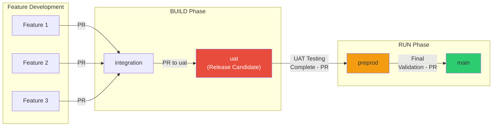

**GitHub Branch Protection Rules (recommended):**
```
main:
  - Require PR reviews: 2 approvers
  - Require status checks: deployment validation
  - No direct pushes

preprod:
  - Require PR reviews: 1 approver
  - Require status checks: deployment validation

uat:
  - Require status checks: deployment validation

integration:
  - Require status checks: deployment validation
```

### 3.2 Gearset: Explicit Release Branch with GitHub Integration

Gearset provides an explicit release branch mechanism for bundling multiple features into a single coordinated release, all managed via GitHub PRs.

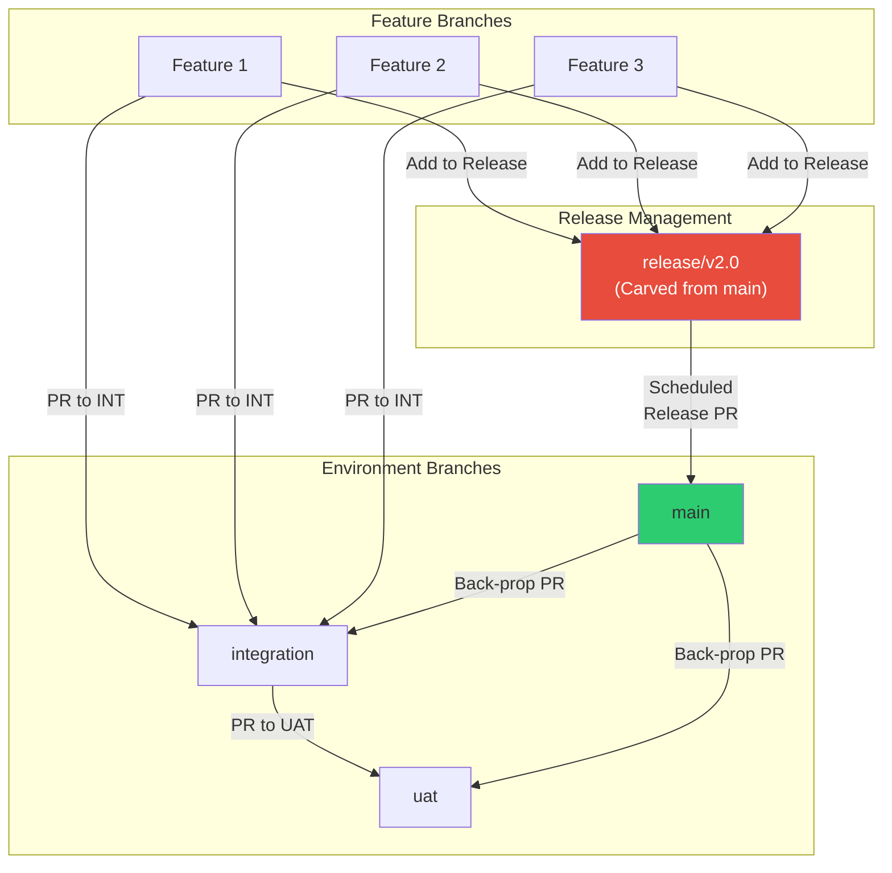

---

## 4. Complete GitHub Workflow Diagrams

### 4.1 sfdx-hardis Complete GitHub Actions Flow

```mermaid
flowchart TB
    subgraph "Developer Workflow"
        START((Start))
        CREATE_SB[Create Source-tracked<br/>Sandbox from INT]
        DEVELOP[Develop in Sandbox]
        PULL[Pull changes to local]
        COMMIT[Commit to feature branch]
        PUSH[Push to GitHub]
        CREATE_PR[Create Pull Request<br/>to integration]
    end
    
    subgraph "GitHub Actions - BUILD"
        VALIDATE_INT[Validate against INT<br/>on PR open]
        MERGE_INT[Merge PR to integration]
        DEPLOY_INT[Deploy to INT Org]
        
        CREATE_PR_UAT[Create PR to uat]
        VALIDATE_UAT[Validate against UAT]
        MERGE_UAT[Merge PR to uat]
        DEPLOY_UAT[Deploy to UAT Org]
    end
    
    subgraph "GitHub Actions - RUN"
        CREATE_PR_PREPROD[Create PR to preprod]
        VALIDATE_PREPROD[Validate against PreProd]
        MERGE_PREPROD[Merge PR to preprod]
        DEPLOY_PREPROD[Deploy to PreProd Org]
        
        CREATE_PR_MAIN[Create PR to main]
        VALIDATE_PROD[Validate against PROD]
        MERGE_MAIN[Merge PR to main]
        DEPLOY_PROD[Deploy to Production]
    end
    
    subgraph "Retrofit via GitHub Actions"
        TRIGGER_RETROFIT[Scheduled/Manual Trigger]
        RETRIEVE_PROD[Retrieve from Production]
        CREATE_RETROFIT_PR[Create Retrofit PR<br/>to preprod]
        MERGE_RETROFIT[Review and Merge PR]
    end
    
    START --> CREATE_SB --> DEVELOP --> PULL --> COMMIT --> PUSH --> CREATE_PR
    CREATE_PR --> VALIDATE_INT
    VALIDATE_INT -->|Pass| MERGE_INT --> DEPLOY_INT
    DEPLOY_INT --> CREATE_PR_UAT --> VALIDATE_UAT
    VALIDATE_UAT -->|Pass| MERGE_UAT --> DEPLOY_UAT
    DEPLOY_UAT --> CREATE_PR_PREPROD --> VALIDATE_PREPROD
    VALIDATE_PREPROD -->|Pass| MERGE_PREPROD --> DEPLOY_PREPROD
    DEPLOY_PREPROD --> CREATE_PR_MAIN --> VALIDATE_PROD
    VALIDATE_PROD -->|Pass| MERGE_MAIN --> DEPLOY_PROD
    
    DEPLOY_PROD --> TRIGGER_RETROFIT
    TRIGGER_RETROFIT --> RETRIEVE_PROD --> CREATE_RETROFIT_PR --> MERGE_RETROFIT
```

**Example GitHub Actions Workflow (.github/workflows/deploy.yml):**
```yaml
name: Deploy to Salesforce
on:
  pull_request:
    branches: [integration, uat, preprod, main]
  push:
    branches: [integration, uat, preprod, main]

jobs:
  validate:
    if: github.event_name == 'pull_request'
    runs-on: ubuntu-latest
    container: hardisgroupcom/sfdx-hardis:latest
    steps:
      - uses: actions/checkout@v4
      - name: Validate Deployment
        run: sf hardis:project:deploy:sources:dx --check

  deploy:
    if: github.event_name == 'push'
    runs-on: ubuntu-latest
    container: hardisgroupcom/sfdx-hardis:latest
    steps:
      - uses: actions/checkout@v4
      - name: Deploy to Org
        run: sf hardis:project:deploy:sources:dx
```

### 4.2 Gearset Complete GitHub Pipeline Flow

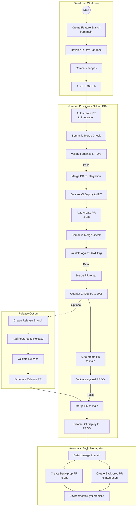

---

## 5. Hotfix Handling Comparison (GitHub)

### 5.1 sfdx-hardis Hotfix Process

```mermaid
flowchart LR
    subgraph "Hotfix in RUN Layer"
        ISSUE[Production Issue]
        CREATE_HF[Create hotfix branch<br/>from preprod]
        FIX[Apply fix]
        PR_PREPROD[PR to preprod]
        DEPLOY_PP[GitHub Actions<br/>Deploy to PreProd]
        PR_MAIN[PR to main]
        DEPLOY_PROD[GitHub Actions<br/>Deploy to Production]
    end
    
    subgraph "Retrofit to BUILD"
        RETROFIT[Retrofit GitHub Action]
        PR_INT[PR to integration]
        SYNC[Sync BUILD layer]
    end
    
    ISSUE --> CREATE_HF --> FIX --> PR_PREPROD --> DEPLOY_PP
    DEPLOY_PP --> PR_MAIN --> DEPLOY_PROD
    DEPLOY_PROD --> RETROFIT --> PR_INT --> SYNC
    
    style ISSUE fill:#e74c3c,color:#fff
```

### 5.2 Gearset Hotfix Process

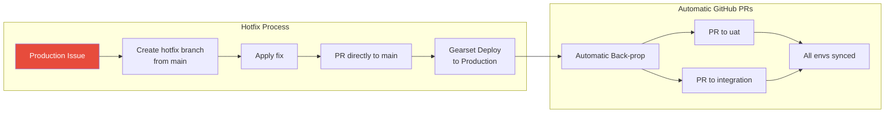

---

## 6. Feature Comparison Table (GitHub Focus)

| Feature | sfdx-hardis | Gearset |
|---------|-------------|---------|
| **Licensing** | Open-source (Free) | Commercial (Paid) |
| **GitHub Integration** | Native GitHub Actions | Native API integration |
| **PR Creation** | Manual (developer creates PRs) | Automatic (promotion branches) |
| **PR Validation** | GitHub Actions workflow | Gearset CI jobs |
| **Branch Strategy** | BUILD/RUN separation | Expanded branching model |
| **Promotion Branches** | Not used | Automatic (gs-pipeline/*) |
| **Conflict Resolution** | Standard Git (manual) | Semantic merge (automated) |
| **Back-sync Mechanism** | Retrofit (scheduled GitHub Action) | Back-propagation (automatic PRs) |
| **Release Branches** | Implicit (UAT state) | Explicit release branch with PRs |
| **PR Comments** | Deployment results posted | Validation results posted |
| **Branch Protection** | Standard GitHub rules | Respects GitHub rules |
| **Status Checks** | Via GitHub Actions | Via Gearset webhooks |
| **Quick Deploy** | Supported | Supported |
| **PR Review Integration** | Native GitHub reviews | Native GitHub reviews |
| **GitHub App** | Not required | Gearset GitHub App |

---

## 7. Pros and Cons Analysis (GitHub Context)

### 7.1 sfdx-hardis with GitHub

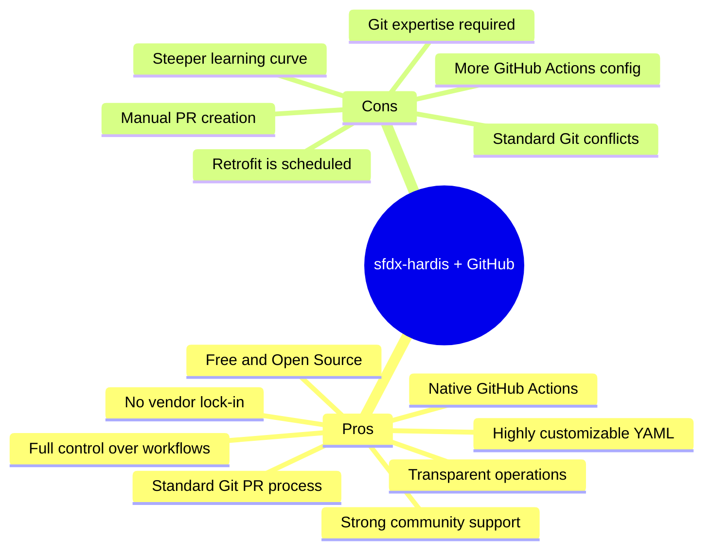

#### Detailed Pros:
1. **Cost-effective**: No licensing costs, uses free GitHub Actions minutes
2. **Native GitHub Actions**: Auto-generated workflows, easy to customize
3. **Standard PR workflow**: Developers use familiar GitHub PR process
4. **Transparency**: All operations visible in GitHub Actions logs
5. **Flexibility**: YAML configuration adapts to any org structure
6. **No vendor lock-in**: Standard Git and Salesforce CLI commands
7. **BUILD/RUN separation**: Clear distinction for production pipeline

#### Detailed Cons:
1. **Manual PR creation**: Developers must create PRs between branches
2. **Git expertise required**: Team needs solid Git fundamentals
3. **Standard conflicts**: No intelligent Salesforce metadata merge
4. **Retrofit timing**: Scheduled jobs, not real-time synchronization
5. **Setup investment**: Initial GitHub Actions configuration required

### 7.2 Gearset with GitHub

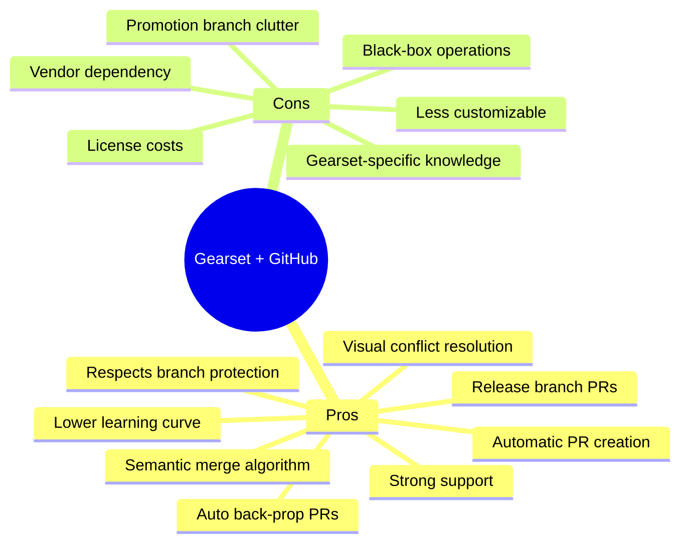

#### Detailed Pros:
1. **Automatic PR creation**: Promotion PRs created automatically in GitHub
2. **Semantic merge**: Understands Salesforce metadata, reduces PR conflicts
3. **Automatic back-propagation**: PRs created automatically after production merge
4. **Visual tools**: Conflict resolution UI integrated with GitHub PRs
5. **Release management**: Explicit release branches with scheduled PR merges
6. **Branch protection**: Respects all GitHub branch protection rules
7. **Lower barrier**: Admins can work without deep Git/GitHub knowledge

#### Detailed Cons:
1. **Cost**: Significant licensing investment
2. **Promotion branches**: gs-pipeline/* branches can clutter repository
3. **Vendor lock-in**: Workflow depends on Gearset infrastructure
4. **Learning curve**: Must understand Gearset's branching model
5. **Reduced transparency**: Some operations abstracted from GitHub

---

## 8. GitHub PR Workflow Comparison

### 8.1 PR Lifecycle Comparison

```mermaid
flowchart TB
    subgraph "sfdx-hardis PR Flow"
        SH_DEV[Developer creates PR]
        SH_GHA[GitHub Actions validates]
        SH_REVIEW[Manual review]
        SH_MERGE[Merge PR]
        SH_DEPLOY[GitHub Actions deploys]
        SH_NEXT[Developer creates next PR]
        
        SH_DEV --> SH_GHA --> SH_REVIEW --> SH_MERGE --> SH_DEPLOY --> SH_NEXT
    end
    
    subgraph "Gearset PR Flow"
        GS_PUSH[Developer pushes]
        GS_AUTO[Gearset auto-creates PR]
        GS_SEMANTIC[Semantic merge check]
        GS_VALIDATE[Gearset validates]
        GS_REVIEW[Manual review]
        GS_PROMOTE[Click Promote in Gearset]
        GS_DEPLOY[Gearset deploys]
        GS_NEXT[Gearset auto-creates next PR]
        
        GS_PUSH --> GS_AUTO --> GS_SEMANTIC --> GS_VALIDATE --> GS_REVIEW --> GS_PROMOTE --> GS_DEPLOY --> GS_NEXT
    end
```

### 8.2 Key GitHub PR Differences

| Aspect | sfdx-hardis | Gearset |
|--------|-------------|---------|
| **PR Creation** | Manual by developer | Automatic by Gearset |
| **PR Source Branch** | Feature branch directly | Promotion branch (gs-pipeline/*) |
| **PR Target** | Next environment branch | Next environment branch |
| **Validation Trigger** | PR open event | PR open + Gearset webhook |
| **Merge Action** | GitHub UI or CLI | Gearset UI (Promote button) |
| **Post-merge Deploy** | GitHub Actions on push | Gearset CI job |
| **Next Environment** | Manual PR creation | Automatic PR creation |
| **Conflict Detection** | Standard Git | Semantic merge |
| **PR Comments** | GitHub Actions results | Gearset validation results |

---

## 9. Decision Matrix

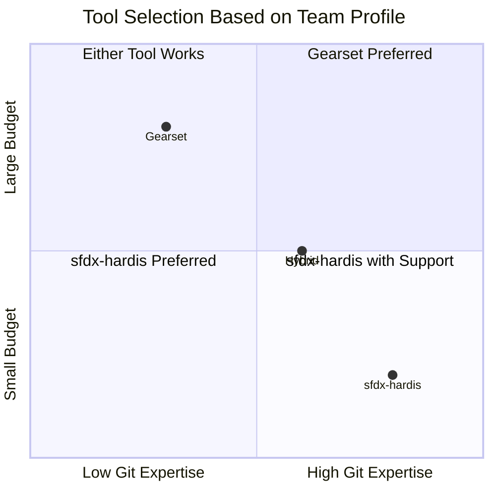

### When to Choose sfdx-hardis with GitHub:
- ✅ Budget constraints or cost-conscious organizations
- ✅ Teams with strong Git and GitHub expertise
- ✅ Need for maximum flexibility in GitHub Actions
- ✅ Preference for standard GitHub PR workflows
- ✅ Already comfortable with GitHub CLI and Actions
- ✅ Multiple projects (reusable workflow templates)

### When to Choose Gearset with GitHub:
- ✅ Teams with mixed technical expertise (admins + devs)
- ✅ Organizations prioritizing automation over customization
- ✅ Need for automatic PR creation and back-propagation
- ✅ Complex release management with bundled features
- ✅ Requirement for semantic merge capabilities
- ✅ Preference for visual tools while using GitHub

---

## 10. Conclusion

Both sfdx-hardis and Gearset provide robust GitOps solutions for Salesforce CI/CD with GitHub, long-lived branches, and permanent orgs. The choice depends on:

| Factor | Favor sfdx-hardis | Favor Gearset |
|--------|-------------------|---------------|
| Budget | Limited | Available |
| GitHub Actions expertise | High | Low-Medium |
| PR automation needs | Standard is fine | Maximum automation |
| Conflict resolution | Standard Git OK | Need semantic merge |
| Team GitHub skills | Strong | Mixed |
| Customization needs | High | Standard |

**Key Takeaway**: 
- **sfdx-hardis** provides a **standard GitHub PR experience** with manual PR creation between branches and GitHub Actions for validation/deployment
- **Gearset** provides an **automated PR experience** with automatic promotion PRs, semantic merge, and automatic back-propagation PRs

The **retrofit (sfdx-hardis)** and **back-propagation (Gearset)** mechanisms serve the same fundamental purpose—keeping environments synchronized via GitHub PRs—but differ in automation level:
- **Retrofit**: Scheduled GitHub Action creates a PR from production changes
- **Back-propagation**: Immediate automatic PRs after merge to main
