# GitOps Delivery Comparison: sfdx-hardis vs Gearset

## Executive Summary

This document compares two Salesforce DevOps approaches for managing deliveries with long-lived branches and permanent orgs (INT, UAT, PROD). Both tools support similar GitOps patterns but differ significantly in implementation, philosophy, and feature sets.

---

## 1. Branch Strategy Overview

### 1.1 sfdx-hardis: Long Branches with Permanent Orgs

sfdx-hardis uses a **BUILD/RUN** separation model with long-lived branches mapped to permanent Salesforce orgs.

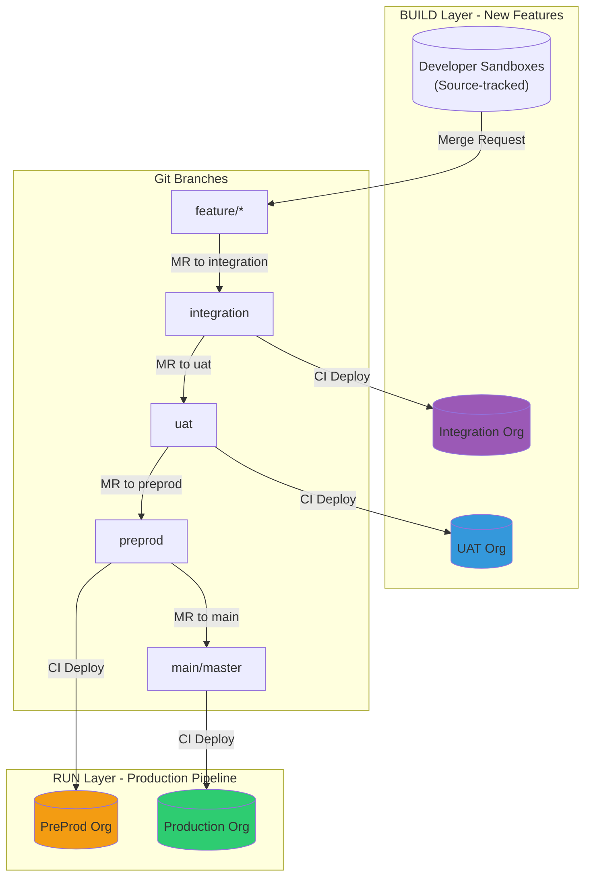

### 1.2 Gearset: Expanded Branching Model

Gearset uses an **expanded branching model** with promotion branches and automatic back-propagation.

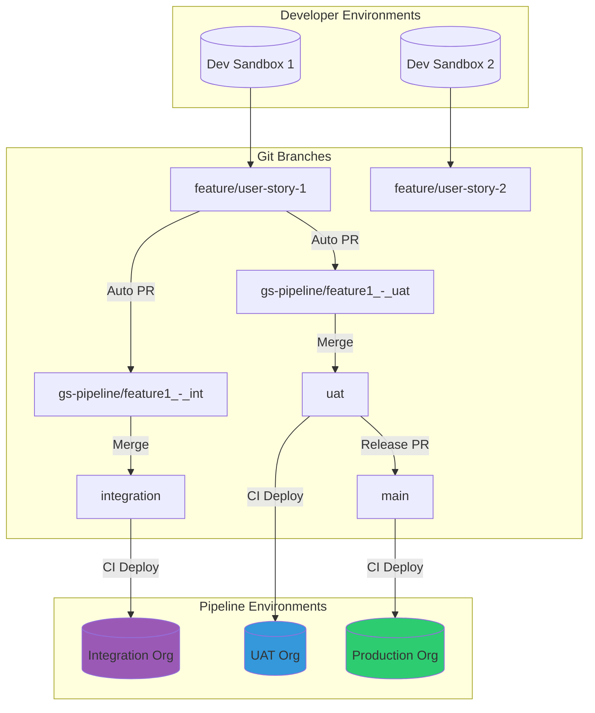

---

## 2. Retrofit vs Back-Propagation

### 2.1 sfdx-hardis Retrofit Process

The retrofit mechanism in sfdx-hardis retrieves production changes and propagates them back to lower environments (typically preprod/uat) to keep environments synchronized.

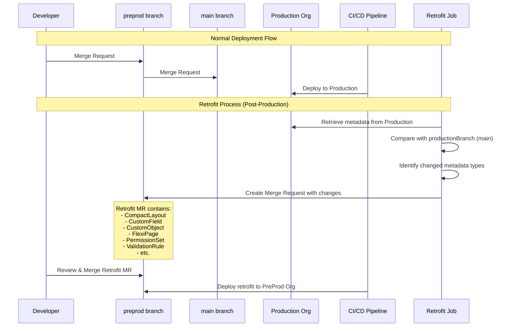

**sfdx-hardis Retrofit Configuration (.sfdx-hardis.yml):**
```yaml
productionBranch: master
retrofitBranch: preprod
sourcesToRetrofit:
  - CompactLayout
  - CustomApplication
  - CustomField
  - CustomLabel
  - CustomMetadata
  - CustomObject
  - FlexiPage
  - Layout
  - PermissionSet
  - ValidationRule
retrofitIgnoredFiles:
  - force-app/main/default/flexipages/Dashboard.flexipage-meta.xml
```

### 2.2 Gearset Back-Propagation Process

Gearset automatically creates back-propagation PRs after changes are merged to production, keeping all upstream environments synchronized.

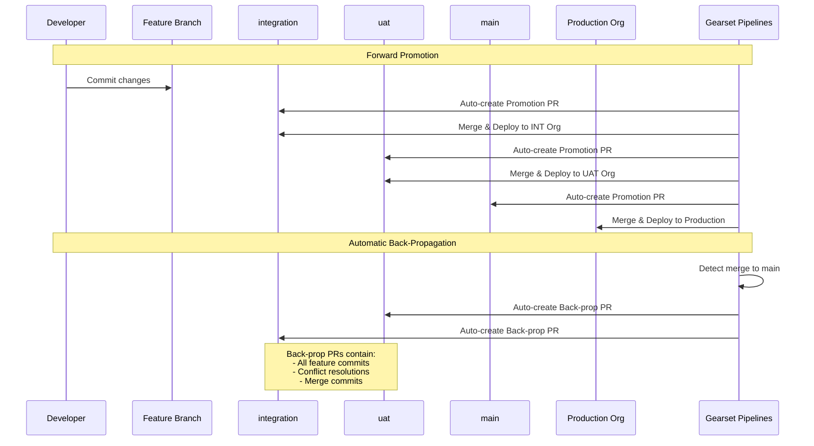

---

## 3. Release Branch Model Comparison

### 3.1 sfdx-hardis: UAT-based Release

In sfdx-hardis, the release is essentially the state of the UAT branch at a given point, which then flows to preprod and production.

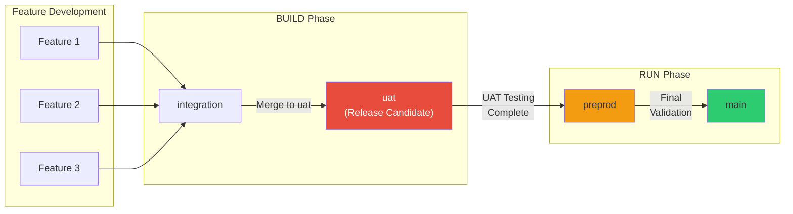

### 3.2 Gearset: Explicit Release Branch

Gearset provides an explicit release branch mechanism for bundling multiple features into a single coordinated release.

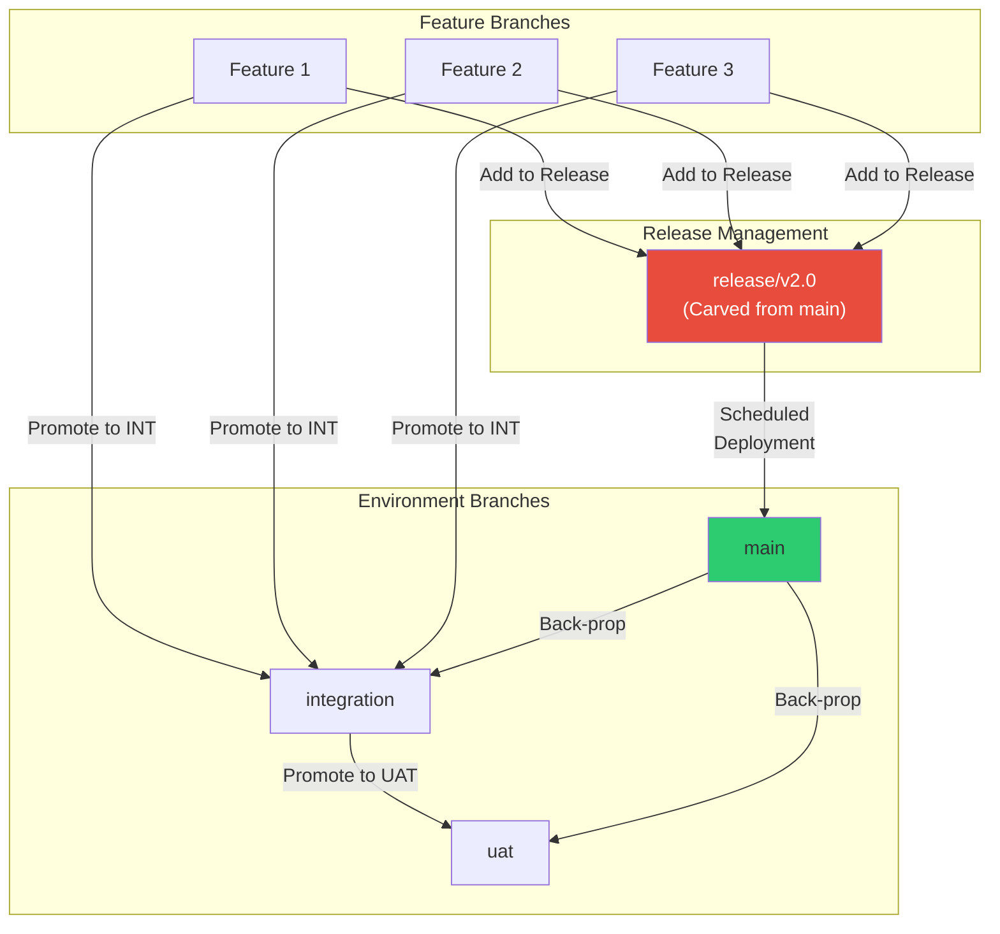

---

## 4. Complete Workflow Diagrams

### 4.1 sfdx-hardis Complete CI/CD Flow

```mermaid
flowchart TB
    subgraph "Developer Workflow"
        START((Start))
        CREATE_SB[Create Source-tracked<br/>Sandbox from INT]
        DEVELOP[Develop in Sandbox]
        PULL[Pull changes to local]
        COMMIT[Commit to feature branch]
        CREATE_MR[Create Merge Request<br/>to integration]
    end
    
    subgraph "CI/CD Pipeline - BUILD"
        VALIDATE_INT[Validate against INT]
        MERGE_INT[Merge to integration]
        DEPLOY_INT[Deploy to INT Org]
        
        CREATE_MR_UAT[Create MR to uat]
        VALIDATE_UAT[Validate against UAT]
        MERGE_UAT[Merge to uat]
        DEPLOY_UAT[Deploy to UAT Org]
    end
    
    subgraph "CI/CD Pipeline - RUN"
        CREATE_MR_PREPROD[Create MR to preprod]
        VALIDATE_PREPROD[Validate against PreProd]
        MERGE_PREPROD[Merge to preprod]
        DEPLOY_PREPROD[Deploy to PreProd Org]
        
        CREATE_MR_MAIN[Create MR to main]
        VALIDATE_PROD[Validate against PROD]
        MERGE_MAIN[Merge to main]
        DEPLOY_PROD[Deploy to Production]
    end
    
    subgraph "Retrofit Process"
        TRIGGER_RETROFIT[Trigger Retrofit Job]
        RETRIEVE_PROD[Retrieve from Production]
        CREATE_RETROFIT_MR[Create Retrofit MR<br/>to retrofitBranch]
        MERGE_RETROFIT[Merge Retrofit]
    end
    
    START --> CREATE_SB --> DEVELOP --> PULL --> COMMIT --> CREATE_MR
    CREATE_MR --> VALIDATE_INT
    VALIDATE_INT -->|Pass| MERGE_INT --> DEPLOY_INT
    DEPLOY_INT --> CREATE_MR_UAT --> VALIDATE_UAT
    VALIDATE_UAT -->|Pass| MERGE_UAT --> DEPLOY_UAT
    DEPLOY_UAT --> CREATE_MR_PREPROD --> VALIDATE_PREPROD
    VALIDATE_PREPROD -->|Pass| MERGE_PREPROD --> DEPLOY_PREPROD
    DEPLOY_PREPROD --> CREATE_MR_MAIN --> VALIDATE_PROD
    VALIDATE_PROD -->|Pass| MERGE_MAIN --> DEPLOY_PROD
    
    DEPLOY_PROD --> TRIGGER_RETROFIT
    TRIGGER_RETROFIT --> RETRIEVE_PROD --> CREATE_RETROFIT_MR --> MERGE_RETROFIT
```

### 4.2 Gearset Complete Pipeline Flow

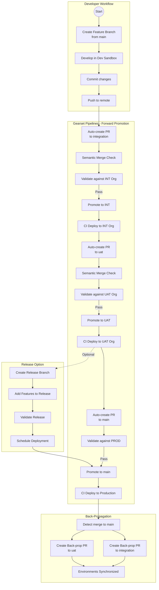

---

## 5. Hotfix Handling Comparison

### 5.1 sfdx-hardis Hotfix Process

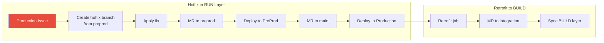

### 5.2 Gearset Hotfix Process

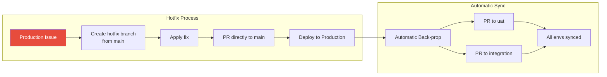

---

## 6. Feature Comparison Table

| Feature | sfdx-hardis | Gearset |
|---------|-------------|---------|
| **Licensing** | Open-source (Free) | Commercial (Paid) |
| **Interface** | CLI + VS Code Extension | Web UI + CLI support |
| **Branch Strategy** | BUILD/RUN separation | Expanded branching model |
| **Promotion Branches** | Manual MR creation | Automatic (gs-pipeline/*) |
| **Conflict Resolution** | Manual Git-based | Semantic merge (automated) |
| **Back-sync Mechanism** | Retrofit (scheduled/manual) | Back-propagation (automatic) |
| **Release Branches** | Implicit (UAT state) | Explicit release branch |
| **CI/CD Providers** | GitLab, GitHub, Azure, Bitbucket | All major providers |
| **Validation** | sfdx/sf commands | Built-in + external tools |
| **Metadata Comparison** | CLI-based | Visual side-by-side |
| **Conflict UI** | Git/IDE native | Built-in visual resolver |
| **Test Automation** | Apex tests via CI | Apex + UI test integration |
| **Static Analysis** | Via MegaLinter/PMD | Built-in + PMD/CodeScan |
| **Quick Deploy** | Supported | Supported |
| **Scratch Org Support** | Yes | Yes |
| **Learning Curve** | Steeper (Git knowledge required) | Gentler (UI abstracts Git) |
| **Customization** | Highly customizable YAML | UI-configured |
| **Support** | Community + paid services | Dedicated support team |

---

## 7. Pros and Cons Analysis

### 7.1 sfdx-hardis

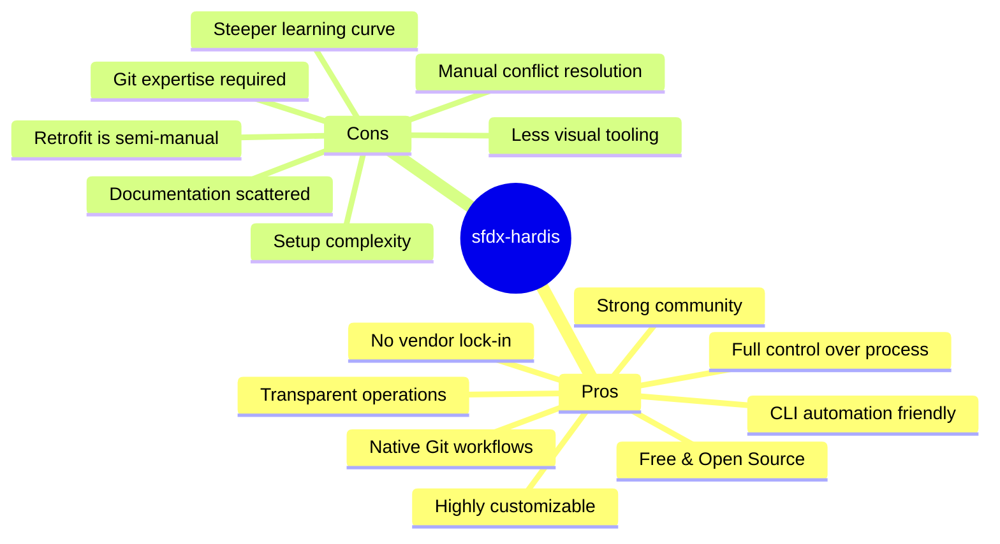

#### Detailed Pros:
1. **Cost-effective**: No licensing costs, enterprise-ready features at zero cost
2. **Transparency**: All operations run native SFDX commands, visible in logs
3. **Flexibility**: Highly configurable via YAML, adaptable to any org structure
4. **No vendor lock-in**: Standard Git and Salesforce CLI, portable knowledge
5. **BUILD/RUN separation**: Clear distinction between development and production pipelines
6. **VS Code integration**: Visual interface for non-CLI users
7. **Active development**: Regular updates, responsive maintainers

#### Detailed Cons:
1. **Git expertise required**: Team needs solid Git fundamentals
2. **Manual retrofit management**: Scheduled jobs need configuration and monitoring
3. **Conflict resolution**: Standard Git conflicts, no intelligent merge
4. **Setup investment**: Initial configuration requires DevOps knowledge
5. **Limited visual diff**: Relies on Git/IDE for metadata comparison

### 7.2 Gearset

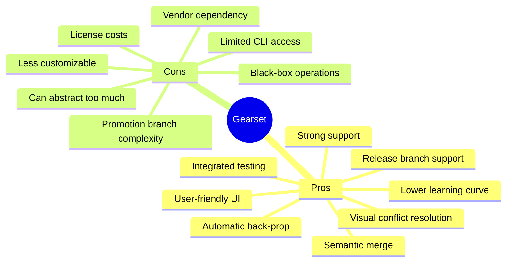

#### Detailed Pros:
1. **Semantic merge**: Understands Salesforce metadata, reduces false conflicts
2. **Automatic back-propagation**: Environments stay synchronized automatically
3. **Visual tools**: Side-by-side comparison, intuitive conflict resolution
4. **Release management**: Explicit release branches with scheduling
5. **Integrated testing**: Built-in Apex tests, static analysis, UI test integration
6. **Lower barrier to entry**: Admins can participate without deep Git knowledge
7. **Enterprise support**: Dedicated DevOps experts available

#### Detailed Cons:
1. **Cost**: Significant licensing investment for enterprise teams
2. **Vendor lock-in**: Workflow depends on Gearset's infrastructure
3. **Reduced transparency**: Some operations are abstracted
4. **Promotion branch overhead**: Additional branches can clutter repository
5. **Customization limits**: Less flexible than code-based solutions
6. **Learning Gearset way**: Must understand their branching model

---

## 8. Decision Matrix

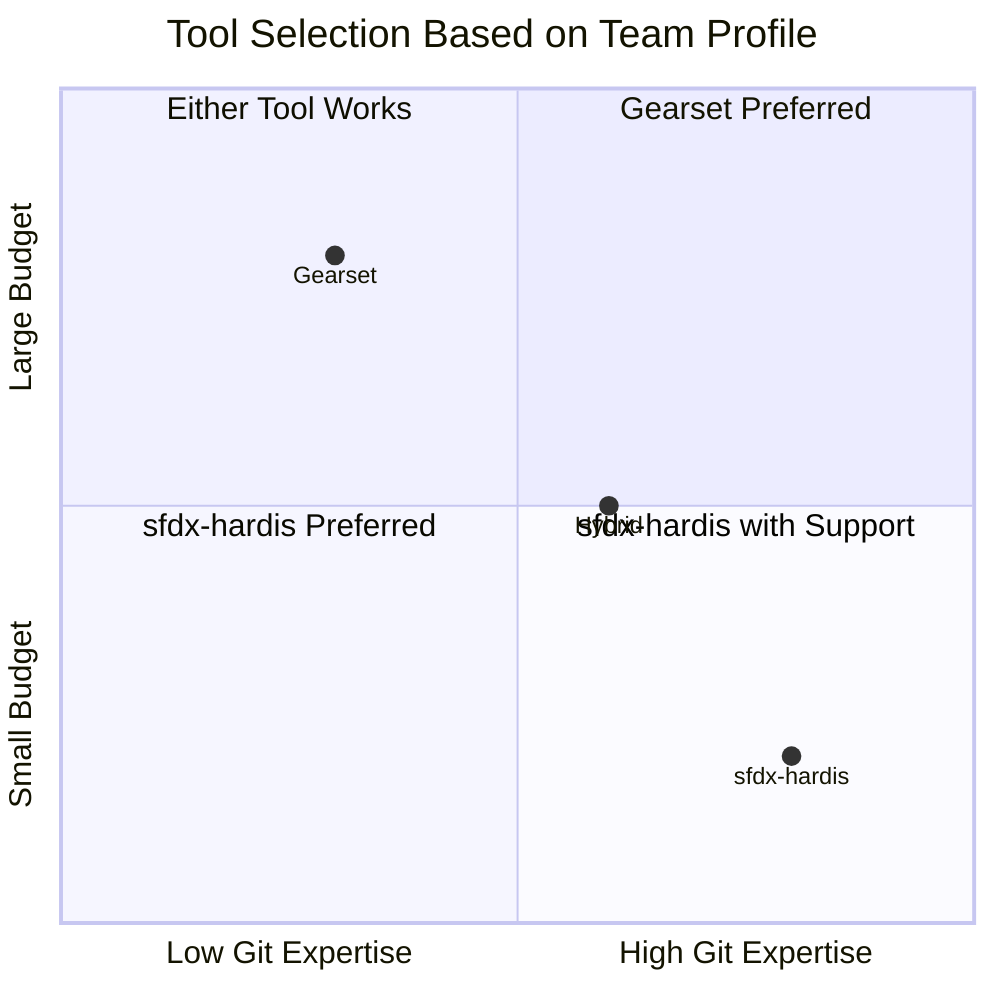

### When to Choose sfdx-hardis:
- ✅ Budget constraints or cost-conscious organizations
- ✅ Teams with strong Git and DevOps expertise
- ✅ Need for maximum flexibility and customization
- ✅ Preference for open-source and transparent operations
- ✅ Already using CLI-heavy workflows
- ✅ Multiple similar projects (reusable configuration)

### When to Choose Gearset:
- ✅ Teams with mixed technical expertise (admins + devs)
- ✅ Organizations prioritizing time-to-value over cost
- ✅ Need for visual tools and reduced Git complexity
- ✅ Complex release management with bundled features
- ✅ Requirement for dedicated vendor support
- ✅ Preference for automatic environment synchronization

---

## 9. Migration Considerations

### 9.1 From sfdx-hardis to Gearset

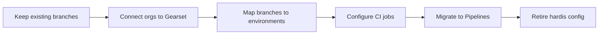

### 9.2 From Gearset to sfdx-hardis

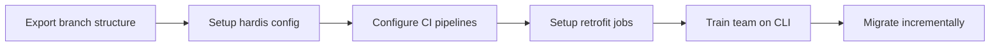

---

## 10. Conclusion

Both sfdx-hardis and Gearset provide robust GitOps solutions for Salesforce CI/CD with long-lived branches and permanent orgs. The choice between them depends on:

| Factor | Favor sfdx-hardis | Favor Gearset |
|--------|-------------------|---------------|
| Budget | Limited | Available |
| Team Git skills | High | Mixed |
| Customization needs | High | Standard |
| Visual tooling | Optional | Required |
| Vendor relationship | Independence | Partnership |
| Time to implement | Can invest | Need speed |

The **retrofit (sfdx-hardis)** and **back-propagation (Gearset)** mechanisms serve the same fundamental purpose—keeping environments synchronized—but differ in automation level and triggering mechanisms. Organizations should evaluate their specific needs, team capabilities, and long-term strategy when selecting between these tools.
